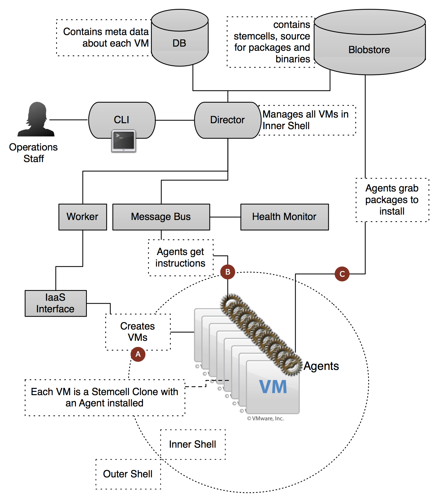

latex input:	mmd-article-header
Title:	BOSH Documentation
Author:	VMware 2012 - Cloud Foundry
Base Header Level:	2
LaTeX Mode:	memoir
latex input:	mmd-article-begin-doc
latex footer:	mmd-memoir-footer

# Introduction #

Cloud Foundry BOSH is an open source tool chain for release engineering, deployment and lifecycle management of large scale distributed services. In this manual we describe the architecture, topology, configuration, and use of BOSH, as well as the structure and conventions used in packaging and deployment.

# Managing Distributed Services #

BOSH was originally developed in the context of the Cloud Foundry Application Platform as a Service, but the framework is general purpose and can be used to deploy other distributed services on top of Infrastructure as a Service (IaaS) products such as VMware vSphere, Amazon Web Services, or OpenStack.

# BOSH Components #

## Fig 1. Interaction of BOSH Components ##

## Infrastructure as a Service (IaaS) ##

The core BOSH engine is abstracted from any particular Infrastructure as a Service (IaaS). IaaS interfaces are implemented as plugins to BOSH. Currently, BOSH supports both VMware vSphere and Amazon Web Services.

## Cloud Provider Interface ##

The IaaS interface plugins communicate through a Cloud Provider Interface (CPI) offered by the particular IaaS vendors such as VMware or Amazon. As a BOSH user there is no need to be concerned with the IaaS or CPI, but it can be helpful to understand its primitives when learning how BOSH works. The current examples of these interfaces are in: `bosh/vsphere_cpi/lib/cloud/vsphere/cloud.rb` for vSphere, and `bosh/aws_cpi/lib/cloud/aws/cloud.rb` for Amazon Web Services. Within those subdirectories are Ruby classes with methods to do the following:

	create_stemcell / delete_stemcell
	create_vm  / delete_vm  / reboot_vm
	configure_networks
	create_disk / delete_disk / attach_disk / detach_disk

Please refer to the API documentation in these files for further explanation of the CPI primitives.

## BOSH Director ##

The Director is the core orchestrating component in BOSH which controls creation of VMs, deployment, and other life cycle events of software and services. Command and control is handed over to the the Director-Agent interaction after the CPI has created resources.

## BOSH Agent ##

BOSH Agents listen for instructions from the BOSH Director. Every VM contains an Agent. Through the Director-Agent interaction, VMs are given [Jobs][], or roles, within Cloud Foundry. If the VM's job is to run MySQL, for example, the Director will send instructions to the Agent about which packages must be installed and what the configurations for those packages are.

## BOSH CLI ##

The BOSH Command Line Interface is how users interact with BOSH using a terminal session. BOSH commands follow the format shown below:

    $ bosh [--verbose] [--config|-c <FILE>] [--cache-dir <DIR>]
           [--force] [--no-color] [--skip-director-checks] [--quiet]
           [--non-interactive]

A full overview of BOSH commands and installation appears in the [BOSH Command Line Interface][] and [BOSH installation][] sections.

## Stemcells ##

A Stemcell is a VM template with an embedded [BOSH Agent][]. The Stemcell used for Cloud Foundry is a standard Ubuntu distribution. Stemcells are uploaded using the [BOSH CLI][] and used by the [BOSH Director][] when creating VMs through the [Cloud Provider Interface][] (CPI). When the Director creates a VM through the CPI, it will pass along configurations for networking and storage, as well as the location and credentials for the [Message Bus][] and the [Blobstore][].

## Releases ##

A Release in BOSH is a packaged bundle of service descriptors known as Jobs. Jobs are collections of software bits and configurations. Any given Release contains all the static bits (source or binary) required to have BOSH manage an application or a distributed service.

A Release is typically not restricted to any particular environment. As such, it can be re-used across clusters handling different stages in a service life cycle, such as Development, QA, Staging, or Production. The [BOSH CLI][] manages both the creation of Releases and their deployments into specific environments.

See the [Releases][] section for a deeper look at both Releases and [Jobs][].

## Deployments ##

While BOSH [Stemcells][] and [Releases][] are static components, they are bound together into a Deployment by a [BOSH Deployment Manifest][]. In the Deployment Manifest, you declare pools of VMs, which networks they live on, and which [Jobs][] (service components) from the Releases you want to activate. Job configurations specify life cycle parameters, the number of instances of a Job, and network and storage requirements. Furthermore, the Deployment Manifest allows you to specify properties used to parameterize configuration templates contained in the Release.

Using the [BOSH CLI][], you specify a Deployment Manifest and perform a Deploy operation (`bosh deploy`), which creates or updates resources on your cluster according to your specifications. Refer to the [Steps of a Deployment][] for examples.

## Blobstore ##

The BOSH Blobstore is used to store the content of Releases (BOSH [Jobs][] and [Packages][] in their source form as well as the compiled image of BOSH Packages. [Releases][releases] are uploaded by the [BOSH CLI][] and inserted into the Blobstore by the [BOSH Director][]. When you deploy a Release, BOSH will orchestrate the compilation of packages and store the result in the Blobstore. When BOSH deploys a BOSH Job to a VM, the BOSH Agent will pull the specified Job and associated BOSH Packages from the Blobstore.

BOSH also uses the Blobstore as an intermediate store for large payloads, such as log files (see BOSH logs) and output from the BOSH Agent that exceeds the max size for messages over the message bus.

There are currently three Blobstores supported in BOSH:

1. [Atmos](http://www.emc.com/storage/atmos/atmos.htm)
1. [S3](http://aws.amazon.com/s3/)
1. [simple blobstore server](https://github.com/cloudfoundry/bosh/tree/master/simple_blobstore_server)

For example configurations of each Blobstore, see the [Blobs][] section. The default BOSH configuration uses the simple blobstore server, as the load is very light and low latency is preferred.

## Health Monitor ##

The BOSH Health Monitor receives health status and life cycle events from the [BOSH Agent][] and can send alerts through notification plugins (such as email). The Health Monitor has a simple awareness of events in the system, so as not to alert if a component is updated.

## Message Bus ##

BOSH uses the [NATS](http://github.com/dcollison/nats) message bus for command and control.

# Using BOSH #

Before we can use BOSH we need to install the [BOSH CLI][]. To continue with this section, you will need a running development environment with an uploaded Stemcell. If this is not the case, you can refer to the [BOSH Installation][] section.

## Installing BOSH Command Line Interface ##

The following steps install BOSH CLI on Ubuntu 10.04 LTS. You can install on either a physical or Virtual Machine.

### Install Ruby via rbenv ###

1. Bosh is written in Ruby. Let's install Ruby's dependencies

		sudo apt-get install git-core build-essential libsqlite3-dev curl \
	    libmysqlclient-dev libxml2-dev libxslt-dev libpq-dev

1. Get the latest version of rbenv

		cd
		git clone git://github.com/sstephenson/rbenv.git .rbenv

1. Add `~/.rbenv/bin` to your `$PATH` for access to the `rbenv` command-line utility

		echo 'export PATH="$HOME/.rbenv/bin:$PATH"' >> ~/.bash_profile

1. Add rbenv init to your shell to enable shims and autocompletion

		echo 'eval "$(rbenv init -)"' >> ~/.bash_profile

1. Download Ruby 1.9.2

_Note: You can also build ruby using the ruby-build plugin for rbenv. See https://github.com/sstephenson/ruby-build_

		wget http://ftp.ruby-lang.org/pub/ruby/1.9/ruby-1.9.2-p290.tar.gz

1. Unpack and install Ruby

    		tar xvfz ruby-1.9.2-p290.tar.gz
    		cd ruby-1.9.2-p290
    		./configure --prefix=$HOME/.rbenv/versions/1.9.2-p290
    		make
    		make install

1. Restart your shell so the path changes take effect

		source ~/.bash_profile

1. Set your default Ruby to be version 1.9.2

		rbenv global 1.9.2-p290

1. Update rubygems and install bundler. 

_Note: After installing gems (`gem install` or `bundle install`) run `rbenv rehash` to add new shims_

		gem update --system
		gem install bundler
		rbenv rehash

### Install Local BOSH and BOSH Releases ###

1. Sign up for the Cloud Foundry Gerrit server at [http://reviews.cloudfoundry.org](http://reviews.cloudfoundry.org)

1. Set up your ssh public key (accept all defaults)

		ssh-keygen -t rsa
		
1. Copy your key from `~/.ssh/id_rsa.pub` into your Gerrit account

1. Create and upload your public SSH key in your Gerrit account profile

1. Set your name and email

		git config --global user.name "Firstname Lastname"
		git config --global user.email "your_email@youremail.com"
		
1. Install our gerrit-cli gem	

		gem install gerrit-cli

1. Clone BOSH repositories from Gerrit

		gerrit clone ssh://reviews.cloudfoundry.org:29418/release.git
		gerrit clone ssh://reviews.cloudfoundry.org:29418/bosh.git
		
1. Run some rake tasks to install the BOSH CLI

		cd ~/bosh
		rake bundle_install (Note: if this fails run 'gem pristine rake' and retry)
		cd cli
		bundle exec rake build
		gem install pkg/bosh_cli-x.x.x.gem
		rbenv rehash

### Deploy to your BOSH Environment ###

With a fully configured environment, we can begin deploying a Cloud Foundry Release to our environment. As listed in the prerequisites, you should already have an environment running, as well as the IP address of the BOSH Director. To set this up, skip to the [BOSH Installation][] section.

### Point BOSH at a Target and Clean your Environment ###

1. Target your Director (this IP is an example.)

		bosh target 11.23.128.219:25555

1. Check the state of your BOSH settings.

		bosh status
		
1. The result of your status will be akin to:

		Target         dev48 (http://11.23.128.219:25555) Ver: 0.3.12 (01169817)
		UUID           4a8a029c-f0ae-49a2-b016-c8f47aa1ac85
		User           admin
		Deployment     not set

1. List any previous Deployments (we will remove them in a moment). If this is your first Deployment, there will be none listed.
    
		bosh deployments

1. The result of `bosh deployments` should be akin to:

		+-------+
		| Name  |
		+-------+
		| dev48 |
		+-------+

1. Delete the existing Deployments (ex: dev48.)

		bosh delete deployment dev48

1. Answer `yes` to the prompt and wait for the deletion to complete.

1. List previous Releases (we will remove them in a moment). If this is your first Deployment, there will be none listed.

		bosh releases

1. The result of `bosh releases` should be akin to:

		+---------------+---------------+
		| Name          | Versions      |
		+---------------+---------------+
		| cloudfoundry	| 47, 55, 58    |
		+---------------+---------------+
		
1. Delete the existing Releases (ex: cloudfoundry)

		bosh delete release cloudfoundry

1. Answer `yes` to the prompt and wait for the deletion to complete.

### Create a Release ###

1. Change directories into the release directory.

		cd ~/release
	
	This directory contains the Cloud Foundry deployment and release files.

1. Reset your environment

		bosh reset release

1. Answer `yes` to the prompt and wait for the environment to be reset

1. Create a Release

		bosh create release --force --with-tarball
		
1. Answer `cloudfoundry` to the `release name` prompt

1. Your terminal will display information about the release including the Release Manifest, Packages, Jobs, and tarball location.

1. Open `bosh-sample-release/cloudfoundry.yml` in your favorite text editor and confirm that `name` is `cloudfoundry` and `version` matches the version that was displayed in your terminal (if this is your first release, this will be version 1.)

### Deploy the Release ###

1. Upload the cloudfoundry Release to your Environment.

		bosh upload release dev_releases/cloudfoundry-1.tgz
		
1. Your terminal will display information about the upload, and an upload progress bar will reach 100% after a few minutes.

1. Open `releases/cloudfoundry.yml` and make sure that your network settings match the environment that you were given.

1. Deploy the Release.

		bosh deploy
		
1. Your deployment will take a few minutes.

1. You may now target the Cloud Foundry deployment using VMC, as described in the Cloud Foundry documentation.

# BOSH Installation #

Installation of BOSH is done using something called Micro BOSH, which is a single VM that includes all of the BOSH components in the same image. If you want to play around with BOSH, or create a simple development setup, you can install Micro BOSH using the [BOSH Deployer][]. If you would like to use BOSH in production to manage a distributed system, you also use the BOSH Deployer, install Micro BOSH, and then use it as means to deploy the final distributed system on multiple VMs.

A good way to think about this two step process is to consider that BOSH is a distributed system in itself. Since BOSH's core purpose is to deploy and manage distributed systems, it makes sense that we would use it to deploy itself. On the BOSH team, we gleefully refer to this as [Inception](http://en.wikipedia.org/wiki/Inception).

## BOSH Deployer ##

### Prerequisites ###

1. It is recommend that you install into an empty gemset (or similar.)

1. Install some core packages on Ubuntu.

		sudo apt-get -y install libsqlite3-dev genisoimage

1. Build the BOSH Deployer, which is also known as Micro BOSH.

		cd bosh/deployer
		bundle install
		rake install

Once you have installed Micro BOSH, you will see some extra commands appear after typing `bosh` on your command line.

**The `bosh micro` commands must be run within the deployments directory**

		% bosh help
		...
		Micro
			micro deployment [<name>] Choose micro deployment to work with
			micro status              Display micro BOSH deployment status
			micro deployments         Show the list of deployments
			micro deploy <stemcell>   Deploy a micro BOSH instance to the currently
                            selected deployment
                            --update   update existing instance
			micro delete              Delete micro BOSH instance (including
                            persistent disk)
			micro agent <args>        Send agent messages
			micro apply <spec>        Apply spec

### Configuration ###

For a minimal configuration example, see: `https://github.com/cloudfoundry/bosh/deployer/spec/assets/test-bootstrap-config.yml`. Note that `disk_path` is `BOSH_Deployer` rather than `BOSH_Disks`. A datastore folder other than `BOSH_Disks` is required if your vCenter hosts other Directors. The `disk_path` folder needs to be created manually. Also, your configuration must live inside a `deployments` directory and follow the convention of having a `$name` subdirectory containing `micro_bosh.yml`, where `$name` is your Deployment name.

For example:

		% find deployments -name micro_bosh.yml
		deployments/vcs01/micro_bosh.yml
		deployments/dev32/micro_bosh.yml
		deployments/dev33/micro_bosh.yml

Deployment state is persisted to deployments/bosh-deployments.yml.

### vCenter Configuration ###

The Virtual Center configuration section looks like the following. 

		cloud:
			plugin: vsphere
				properties:
    			agent:
      			ntp:
       			- <ntp_host_1>
       			- <ntp_host_2>
    			vcenters:
      				- host: <vcenter_ip>
        			user: <vcenter_userid>
        			password: <vcenter_password>
        		datacenters:
          		- name: <datacenter_name>
            		vm_folder: <vm_folder_name>
            		template_folder: <template_folder_name>
            		disk_path: <subdir_to_store_disks>
            		datastore_pattern: <data_store_pattern>
            		persistent_datastore_pattern: <persistent_datastore_pattern>
            		allow_mixed_datastores: <true_if_persistent_datastores_and_datastore_patterns_are_the_same>
            		clusters:
            		- <cluster_name>:
                		resource_pool: <resource_pool_name>

Before you can run micro BOSH deployer, you have to do the following within Virtual Center:

1. Create the vm_folder

1. Create the template_folder

1. Create the disk_path in the appropriate datastores

1. Create the resource_pool. 

A resource pool is optional -- you can run without a resource pool. Without a resource pool, the cluster property looks like:

            		persistent_datastore_pattern: <datastore_pattern>
            		allow_mixed_datastores: <true_if_persistent_datastores_and_datastore_patterns_are_the_same>
            		clusters:
            		- <cluster_name>

The datastore pattern above could just be the name of a datastore or some regular expression matching the datastore name. 

If you had a datastore called "vc_data_store_1" and you wanted to use this datastore for both persistent and non persistent disks, your config would look like:

            		datastore_pattern: vc_data_store_1 
            		persistent_datastore_pattern:  vc_data_store_1
            		allow_mixed_datastores: true

If you had 2 datastores, called "vc_data_store_1" and "vc_data_store_2", and you wanted to use both datastores for both persistent and non persistent disks, your config would look like:

            		datastore_pattern: vc_data_store_? 
            		persistent_datastore_pattern:  vc_data_store_?
            		allow_mixed_datastores: true

If you had 2 datastores, called "vnx:1" and "vnx:2", and you wanted to separate your persistent and non persistent disks, your config would look like:

            		datastore_pattern: vnx:1 
            		persistent_datastore_pattern: vnx:2
            		allow_mixed_datastores: false

### Deployment ###

1. Download a micro BOSH Stemcell:

		% mkdir -p ~/stemcells
		% cd stemcells
		% bosh public stemcells
		+-------------------------------+----------------------------------------------------+
		| Name                          | Url                                                |
		+-------------------------------+----------------------------------------------------+
		| bosh-stemcell-0.4.7.tgz       | https://blob.cfblob.com/rest/objects/4e4e7...h120= |
		| micro-bosh-stemcell-0.1.0.tgz | https://blob.cfblob.com/rest/objects/4e4e7...5Mms= |
		| bosh-stemcell-0.3.0.tgz       | https://blob.cfblob.com/rest/objects/4e4e7...mw1w= |
		| bosh-stemcell-0.4.4.tgz       | https://blob.cfblob.com/rest/objects/4e4e7...r144= |
		+-------------------------------+----------------------------------------------------+
		To download use 'bosh download public stemcell <stemcell_name>'.
		% bosh download public stemcell micro-bosh-stemcell-0.1.0.tgz
		

1. Set the micro BOSH Deployment using:

		% cd /var/vcap/deployments
		% bosh micro deployment dev33
		Deployment set to '/var/vcap/deployments/dev33/micro_bosh.yml'

1. Deploy a new micro BOSH instance and create a new persistent disk:

		% bosh micro deploy ~/stemcells/micro-bosh-stemcell-0.1.0.tgz

1. Update an existing micro BOSH instance. The existing persistent disk will be attached to the new VM:

		% bosh micro deploy ~/stemcells/micro-bosh-stemcell-0.1.1.tgz --update

### Deleting a micro BOSH deployment ###

The `delete` command will delete the VM, Stemcell, and persistent disk.

Example:

		% bosh micro delete

### Checking Status of a micro BOSH deploy ###

The status command will show the persisted state for a given micro BOSH instance

		% bosh micro status
		Stemcell CID   sc-f2430bf9-666d-4034-9028-abf9040f0edf
		Stemcell name  micro-bosh-stemcell-0.1.0
		VM CID         vm-9cc859a4-2d51-43ca-8dd5-220425518fd8
		Disk CID       1
		Deployment     /var/vcap/deployments/dev33/micro_bosh.yml
		Target         micro (http://11.23.194.100:25555) Ver: 0.3.12 (00000000)

### Listing Deployments ###

The `deployments` command prints a table view of deployments/bosh-deployments.yml

		% bosh micro deployments

### Applying a specification

The micro-bosh-stemcell includes an embedded `apply_spec.yml`. This command can be used to apply a different spec to an existing instance. The `apply_spec.yml` properties are merged with your Deployment's network.ip and cloud.properties.vcenters properties.

		% bosh micro apply apply_spec.yml

### Sending messages to the micro BOSH agent ###

The CLI can send messages over HTTP to the agent using the `agent` command.

Example:

		% bosh micro agent ping
		"pong"

## Deploy BOSH as an application using micro BOSH. ##

1. Deploy micro BOSH. See the steps in the previous section.

1. Once your micro BOSH instance is deployed, you can target its Director:

		$ bosh micro status
		...
		Target         micro (http://11.23.194.100:25555) Ver: 0.3.12 (00000000)

		$ bosh target http://11.23.194.100:25555
		Target set to 'micro (http://11.23.194.100:25555) Ver: 0.3.12 (00000000)'

		$ bosh status
		Updating director data... done

		Target         micro (http://11.23.194.100:25555) Ver: 0.3.12 (00000000)
		UUID           b599c640-7351-4717-b23c-532bb35593f0
		User           admin
		Deployment     not set

### Download a BOSH stemcell 

1. List public Stemcells with `bosh public stemcells`

		% mkdir -p ~/stemcells
		% cd stemcells
		% bosh public stemcells
		+-------------------------------+----------------------------------------------------+
		| Name                          | Url                                                |
		+-------------------------------+----------------------------------------------------+
		| bosh-stemcell-0.4.7.tgz       | https://blob.cfblob.com/rest/objects/4e4e7...h120= |
		| micro-bosh-stemcell-0.1.0.tgz | https://blob.cfblob.com/rest/objects/4e4e7...5Mms= |
		| bosh-stemcell-0.3.0.tgz       | https://blob.cfblob.com/rest/objects/4e4e7...mw1w= |
		| bosh-stemcell-0.4.4.tgz       | https://blob.cfblob.com/rest/objects/4e4e7...r144= |
		+-------------------------------+----------------------------------------------------+
		To download use 'bosh download public stemcell <stemcell_name>'.
		

1. Download a public Stemcell. *NOTE, in this case you do not use the micro BOSH Stemcell.*

		bosh download public stemcell bosh-stemcell-0.1.0.tgz

1. Upload the downloaded Stemcell to micro BOSH.

		bosh upload stemcell bosh-stemcell-0.1.0.tgz

### Upload a BOSH release ###

1. You can create a BOSH release or use one of the public releases. The following steps show the use of a public release.

		cd /home/bosh_user 
		gerrit-clone ssh://reviews.cloudfoundry.org:29418/bosh-release.git

1. Upload a public release from bosh-release

		cd /home/bosh_user/bosh-release/releases/
		bosh upload release bosh-1.yml

### Setup a BOSH deployment manifest and deploy ###

1. Create and setup a BOSH deployment manifest. Look at the sample BOSH manifest in (https://github.com/cloudfoundry/oss-docs/bosh/samples/bosh.yml). Assuming you have created a `bosh.yml` in `/home/bosh_user`.

		cd /home/bosh_user
		bosh deployment ./bosh.yml

1. Deploy BOSH

		bosh deploy.

1. Target the newly deployed BOSH Director. In the sample `bosh.yml`, the BOSH Director has the ip address 192.0.2.36. You target this Director with `bosh target http://192.0.2.36:25555` where 25555 is the default BOSH Director port.  Your newly installed BOSH instance is now ready for use.

# BOSH Command Line Interface #

The BOSH command line interface is used to interact with the BOSH director to perform actions on the cloud.  For the most recent documentation on its functions, install BOSH and simply type `bosh`.  Usage:

    bosh [--verbose] [--config|-c <FILE>] [--cache-dir <DIR]
         [--force] [--no-color] [--skip-director-checks] [--quiet]
         [--non-interactive]
         command [<args>]

Currently available bosh commands are:

    Deployment
      deployment [<name>]       Choose deployment to work with (it also updates
                                current target)
      delete deployment <name>  Delete deployment
                                --force    ignore all errors while deleting
                                           parts of the deployment
      deployments               Show the list of available deployments
      deploy                    Deploy according to the currently selected
                                deployment manifest
                                --recreate recreate all VMs in deployment
      diff [<template_file>]    Diffs your current BOSH deployment
                                configuration against the specified BOSH
                                deployment configuration template so that you
                                can keep your deployment configuration file up to
                                date. A dev template can be found in deployments
                                repos.

    Release management
      create release            Create release (assumes current directory to be a
                                release repository)
                                --force    bypass git dirty state check
                                --final    create production-ready release
                                           (stores artefacts in blobstore,
                                           bumps final version)
                                --with-tarball
                                           create full release tarball(by
                                           default only manifest is created)
                                --dry-run  stop before writing release manifest
                                           (for diagnostics)
      delete release <name> [<version>]
                                Delete release (or a particular release version)
                                --force    ignore errors during deletion
      verify release <path>     Verify release
      upload release [<path>]   Upload release (<path> can point to tarball or
                                manifest, defaults to the most recently created
                                release)
      releases                  Show the list of available releases
      reset release             Reset release development environment (deletes
                                all dev artifacts)

      init release [<path>]     Initialize release directory
      generate package <name>   Generate package template
      generate job <name>       Generate job template

    Stemcells
      upload stemcell <path>    Upload the stemcell
      verify stemcell <path>    Verify stemcell
      stemcells                 Show the list of available stemcells
      delete stemcell <name> <version>
                                Delete the stemcell
      public stemcells          Show the list of publicly available stemcells for
                                download.
      download public stemcell <stemcell_name>
                                Downloads a stemcell from the public blobstore.

    User management
      create user [<name>] [<password>]
                                Create user

    Job management
      start <job> [<index>]     Start job/instance
      stop <job> [<index>]      Stop job/instance
                                --soft     stop process only
                                --hard     power off VM
      restart <job> [<index>]   Restart job/instance (soft stop + start)
      recreate <job> [<index>]  Recreate job/instance (hard stop + start)

    Log management
      logs <job> <index>        Fetch job (default) or agent (if option provided)
                                logs
                                --agent    fetch agent logs
                                --only <filter1>[...]
                                           only fetch logs that satisfy given
                                           filters (defined in job spec)
                                --all      fetch all files in the job or agent log
                                           directory

    Task management
      tasks                     Show the list of running tasks
      tasks recent [<number>]   Show <number> recent tasks
      task [<task_id>|last]     Show task status and start tracking its output
                                --no-cache don't cache output locally
                                --event|--soap|--debug
                                           different log types to track
                                --raw      don't beautify log
      cancel task <id>          Cancel task once it reaches the next cancel
                                checkpoint

    Property management
      set property <name> <value>
                                Set deployment property
      get property <name>       Get deployment property
      unset property <name>     Unset deployment property
      properties                List current deployment properties
                                --terse    easy to parse output

    Maintenance
      cleanup                   Remove all but several recent stemcells and
                                releases from current director (stemcells and
                                releases currently in use are NOT deleted)
      cloudcheck                Cloud consistency check and interactive repair
                                --auto     resolve problems automatically (not
                                           recommended for production)
                                --report   generate report only, don't attempt
                                           to resolve problems

    Misc
      status                    Show current status (current target, user,
                                deployment info etc.)
      vms [<deployment>]        List all VMs that supposed to be in a deployment
      target [<name>] [<alias>] Choose director to talk to (optionally creating
                                an alias). If no arguments given, show currently
                                targeted director
      login [<name>] [<password>]
                                Provide credentials for the subsequent
                                interactions with targeted director
      logout                    Forget saved credentials for targeted director
      purge                     Purge local manifest cache

    Remote access
      ssh <job> [index] [<options>] [command]
                                Given a job, execute the given command or start an
                                interactive session
                                --public_key <file>
                                --gateway_host <host>
                                --gateway_user <user>
                                --default_password
                                           Use default ssh password. Not
                                           recommended.
      scp <job> <--upload | --download> [options] /path/to/source /path/to/destination
                                upload/download the source file to the given job.
                                Note: for dowload /path/to/destination is a
                                directory
                                --index <job_index>
                                --public_key <file>
                                --gateway_host <host>
                                --gateway_user <user>
      ssh_cleanup <job> [index] Cleanup SSH artifacts

    Blob
      upload blob <blobs>       Upload given blob to the blobstore
                                --force    bypass duplicate checking
      sync blobs                Sync blob with the blobstore
                                --force    overwrite all local copies with the
                                           remote blob
      blobs                     Print blob status

# Releases #

A release is a collection of source code, configuration files and startup scripts used to run services, along with a version number that uniquely identifies the components. When creating a new release, you should use a source code manager (like [git](http://git-scm.com/)) to manage new versions of the contained files.

## Release Repository ##

A BOSH Release is built from a directory tree with the contents described in this section. A typical release repository has the following sub-directories:

| Directory 	| Contents 	|
| ------------	| ----------	|
| `jobs` 	| job definitions 	|
| `packages` 	| package definitions 	|
| `config` 	| release configuration files 	|
| `releases` 	| final releases 	|
| `src` 	| source code for packages 	|
| `blobs` 	| large source code bundles 	|

## Jobs ##

Jobs are realization of packages, i.e. running one or more processes from a package. A job contains the configuration files and startup scripts to run the binaries from a package.

There is a *one to many* mapping between jobs and VMs - only one job can run in any given VM, but many VMs can run the same job. E.g. there can be four VMs running the Cloud Controller job, but the Cloud Controller job and the DEA job can not run on the same VM. If you need to run two different processes (from two different packages) on the same VM, you need to create a job which starts both processes.

### Prepare script ###

If a job needs to assemble itself from other jobs (like a super-job) a `prepare` script can be used, which is run before the job is packaged up, and can create, copy or modify files.

### Job templates ###

The job templates are generalized configuration files and scripts for a job, which uses [ERB](http://ruby-doc.org/stdlib-1.9.3/libdoc/erb/rdoc/ERB.html) files to generate the final configuration files and scripts used when a Stemcell is turned into a job.

When a configuration file is turned into a template, instance specific information is abstracted into a property which later is provided when the [director][director] starts the job on a VM. E.g. which port the webserver should run on, or which username and password a databse should use.

The files are located in the `templates` directory and the mapping between template file and its final location is provided in the job `spec` file in the templates section. E.g.

    templates:
      foo_ctl.erb: bin/foo_ctl
      foo.yml.erb: config/foo.yml
      foo.txt: config/foo.txt

### Use of properties ###

The properties used for a job comes from the deployment manifest, which passes the instance specific information to the VM via the [agent][agent].

### "the job of a vm" ###

When a VM is first started, is a Stemcell, which can become any kind of job. It is first when the director instructs the VM to run a job as it will gets its *personality*.

### Monitrc ###

BOSH uses [monit](http://mmonit.com/monit/) to manage and monitor the process(es) for a job. The `monit` file describes how the BOSH [agent][agent] will stop and start the job, and it contains at least three sections:

`with pidfile`
: Where the process keeps its pid file

`start program`
: How monit should start the process

`stop program`
: How monit should stop the process

Usually the `monit` file contain a script to invoke to start/stop the process, but it can invoke the binary directly.

### DNS support ###

TBW

## Packages ###

A package is a collection of source code along with a script that contains instruction how to compile it to binary format and install it, with optional dependencies on other pre-requisite packages.

### Package Compilation ###

Packages are compiled on demand during the deployment. The [director][director] first checks to see if there already is a compiled version of the package for the stemcell version it is being deployed to, and if it doesn't already exist a compiled version, the director will instantiate a compile VM (using the same stemcell version it is going to be deployed to) which will get the package source from the blobstore, compile it, and then package the resulting binaries and store it in the blobstore.

To turn source code into binaries each package has a `packaging` script that is responsible for the compilation, and is run on the compile VM. The script gets two environment variables set from the BOSH agent which tells it where to install the files the package generates `BOSH_INSTALL_TARGET`, and the other is `BOSH_COMPILE_TARGET` which is the directory containing the source (which is the current directory when the `packaging` script is invoked). The `BOSH_INSTALL_TARGET` is set to `/var/vcap/data/packages/<package name>/<package version>`. When the package is installed a symlink is created from `/var/vcap/packages/<package name>` which points to the latest version of the package. This link should be used when refering to another package in the `pckaging` script.

There is an optional `pre_packaging` script, which is run when the source of the package is assembled during the `bosh create release`. It can for instance be used to limit which parts of the source that get packages up and stored in the blobstore. It gets the environment variable `BUILD_DIR` set by the [BOSH cli][bosh_cli], which is the directory containing the source to be packaged.

### Package specs ###

The package contents are specified in the `spec` file, which has three sections:

`name`
: The name of the package.

`dependencies`
: An optional list of other packages this package depends on, [see below][Dependencies].

`files`
: A list of files this package contains, which can contain globs. A `*` matches any file and can be restricted by other values in the glob, e.g. `*.rb` only matches files ending with `.rb`. A `**` matches directories recursively.

### Dependencies ###

The package `spec` file contains a section which lists other packages the current package depends on. These dependencies are compile time dependencies, as opposed to the job dependencies which are runtime dependencies.

When the [director][director] plans the compilation of a package during a deployment, it first makes sure all dependencies are compiled before it proceeds to compile the current package, and prior to commencing the compilation all dependent packages are installed on the compilation VM.

## Sources ##

The `src` directory contains the source code for the packages.

If you are using a source code repository to manage your release, you should avoid storing large objects in it (like source code tar-balls in the `src` directory), and instead use the [blobs][blobs] described below.

## Blobs ##

To create final releases you need to configure your release repository with a blobstore. This is where BOSH will upload the final releases to, so that the release can later be retreived from another computer.

To prevent the release repository from becoming bloated with large binary files (source tar-balls), large files can be placed in the `blobs` directory, and then uploaded to the blobstore.

For production releases you should use either the Atmos or S3 blobstore and configure them as described below.

### Atmos ###

Atmos is a shared storage solution from EMC. To use Atmos, edit `config/final.tml` and `config/private.yml`, and add the following (replacing the `url`, `uid` and `secret` with your account information):

File `config/final.yml`

    ---
    blobstore:
      provider: atmos
      options:
        tag: BOSH
        url: https://blob.cfblob.com
        uid: 1876876dba98981ccd091981731deab2/user1

File `config/private.yml`

    ---
    blobstore_secret: ahye7dAS93kjWOIpqla9as8GBu1=

### S3 ###

To use S3, a shared storage solution from Amazon, edit `config/final.tml` and `config/private.yml`, and add the following (replacing the `access_key_id`, `bucket_name`, `encryption_key` and `secret_access_key` with your account information):

File `config/final.yml`

    ---
    blobstore:
      provider: s3
      options:
        access_key_id: KIAK876234KJASDIUH32
        bucket_name: 87623bdc
        encryption_key: sp$abcd123$foobar1234

File `config/private.yml`

    ---
    blobstore_secret: kjhasdUIHIkjas765/kjahsIUH54asd/kjasdUSf

### Local ###

If you are trying out BOSH and don't have an Atmos or S3 account, you can use the local blobstore provider (which stored the files on disk instead of a remote server).

File `config/final.yml`

    ---
    blobstore:
      provider: local
      options:
        blobstore_path: /path/to/blobstore/directory

Note that local should **only** be used for testing purposes as it can't be shared with others (unless they run on the same system).

## Configuring Releases ##

Initial release configuration can be performed using `bosh init release command` in an empty git repo. This will create a number of directories that can be used to keep jobs, packages and sources.

## Building Releases ##

To create a new release use the `bosh create release` command. This will attempt to create a new release from the contents of the release repo. Here's what happens:

* BOSH CLI identifies it's in a release repo directory and tries to find all jobs and packages in that repo. Then, for each artifact (package/job):
	1. The fingerprint is built using artifact contents, file permissions and some other trackable data.
	2. BOSH CLI tries to find the 'final' version of the artifact matching that fingerprint. All 'final' versions are supposed to be shared through a blobstore, with blobstore id being tracked in release repo. Once required blobstore id is found, CLI tries to either find the actual artifact in a local cache, and if it's missing or has a checksum mismatch, it fetches it from the blobstore (saving in a local cache afterwards).
	3. If no final version is found, CLI tries to find dev version in a local cache. Dev versions are specific to a local copy of a release repo on a developer box, so no downloads are attempted, it's either available locally or not.
	4. If the artifact (either dev or final) has been found, CLI uses the version associated with that artifact. The whole process in steps 1-4 is then essentially a lookup of the tarball and its version by a calculated fingerprint. Any change in package/job is supposed to change its fingerprint and this trigger step 5 (generating a new version).
	5. If new artifact version needs to be generated, CLI uses its spec file to understand what needs to be included into the resulting tarball. For packages it resolves dependencies, copies matched files and runs `pre_packaging` script if available. For jobs it checks that all included packages and configurations templates are present. If all checks have passed, CLI generates and packs a new artifact tarball and assigns it a new version (see release versioning below).
* At this point all packages and jobs have been generated and CLI has references to them. The only remaining step is to generate a release manifest, binding all these jobs and packages together. The resulting YAML file is saved and path is provided to CLI user. This path can be used with `bosh upload release`  command to upload release to BOSH Director.

## Final Releases & release versioning ##

The final release can be created once all the changes are tested and it's time to actually deploy a release to production. The are there main criteria differentiating final releases from dev releases:

1. Versioning scheme: final releases are version independently. Every time new final release is generated its version is a simple increment of the previous final release version, no matter how many dev releases have been created in between. Same is true for individual release artifacts, their final versions are independent from dev versions.
2. Blobs sharing: package and job tarballs included into the final release are also being uploaded to a blobstore, so any person who attempts create release in the same release repo in the future will be using same actual bits instead of generating them locally. This is important for consistency and for being able to generate old versions of final releases if needed. 
3. Only reusing components, not generating new ones: final release is supposed to include only previously generated artifacts. If the fingerprint calculated from the current state of the repo didn't match previously generated dev or final version, the error will be raised, telling CLI user to make sure to generate and test dev release first.
 
Final release can be created by running `bosh create release --final`. Usually only people involved in updating production system should be generating final releases. There's also a `--dry-run` option to test out release creation without actually generating and uploading artifacts.

By default all artifacts are stored in `.final_builds` directory inside the release repo, while release manifests are kept in `releases` directory. If the actual release tarball is required `bosh create release --with tarball` can be used. Also, `bosh create release /path/to/release_manifest.yml` can be used to recreate previously created release from its manifest. In both cases the output is a self-contained, ready-to-upload release tarball.

Dev release artifacts versioning is slightly different from final: the latest generated final version of the artifact is used as major version of dev build, while the actual build revision is used as minor version.

An example is as follows:

1. There is a cloud_controller package in release repo: no dev version, no final version yet.
2. `bosh create release` runs for the first time
3. Now there is dev release 1, cloud_controller now has dev version 0.1, no final version yet
4. `bosh create release` is a no-op now, unless we make some repo changes.

5. Someone edits one or more files matched by cloud_controller package.
6. `bosh create release` now generates dev release 2, cloud_controller has dev version 0.2, no final version yet.
7. `bosh create release --final` will now create final release 1, cloud_controller has dev version 0.2, which also gets rebranded as final version 1.
8. Next edits to cloud_controller will subsequently generate dev version 1.1, 1.2 etc., until new final version is created

The main point of this versioning scheme is to partition release engineering process between two audiences: 

1. Developers who are quickly iterating on their changes and don't really care about keeping consistent versioning of Bosh Release, BOSH CLI takes care of all versioning details for them and prevents others from seeing all the work-in-progress releases.
2. SREs who are actually building releases for production use and want them to be consistently versioned and source controlled.

# BOSH Deployments #

## Steps of a Deployment ##

When you do a deploy using BOSH the following sequence of steps occur:

1. Preparing deployment
    * binding deployment - Creates an entry in the Director's database for the deployment if it doesn't exist.
    * binding release - Makes sure the release specified in deployment configuration exists then locks it from being deleted.
    * binding existing deployment - Takes existing VMs and sets them up to be used for the deployment.
    * binding resource pools - Gives idle VMs network reservations.
    * binding stemcells - Makes sure the stemcell specified has been uploaded and then locks it from being deleted.
    * binding templates - Sets up internal data objects to track packages and their pre-reqs for installation.
    * binding unallocated VMs - For each job instance required it determines whether a VM running the instance already exists and assigns one if not.
    * binding instance networks - Reserves networks for each VM that doesn't have one.
1. Compiling packages - Calculates all packages and their dependencies that need to be compiled.  It then begins compiling the packages and storing their output in the blobstore.  The number of `workers` specified in the deployment configuration determines how many VMs can be created at once for compiling.
1. Preparing DNS - Creates DNS entry if it doesn't exist.
1. Creating bound missing VMs - Creates new VMs, deletes extra/oudated/idle VMs.
1. Binding instance VMs - Any unbound VMs are setup for the deployment.
1. Preparing configuration - Pulls in the configurations for each job to be run.
1. Updating/deleting jobs - Deletes unneeded instances, creates needed instances, updates existing instances if they are not already updated.  This is the step where things get pushed live.
1. Refilling resource pools - Creates missing VMs across resource pools after all instance updaters are finished to create additional VMs in order to balance resource pools.

## BOSH Deployment Manifest

The BOSH Deployment manifest is a YAML file defining the layout and properties of the deployment. When BOSH user initiates a new deployment using CLI, BOSH Director receives a version of deployment manifest and creates a new deployment plan using this manifest (see [Steps of a Deployment][]). Manifest contains several sections:

* `name` [String, required] Deployment name. Single BOSH Director can manage multiple deployments and distinguishes them by name.
* `director_uuid` [String, required] Director UUID. Identifies BOSH Director that manages given deployment. A targeted Director UUID should match this property in order for BOSH CLI to allow any operations on the deployment.
* `release` [Hash, required] Release properties.
	* `name` [String, required] Release name. References a release name that wiill be used to resolve the components of the deployment (packages, jobs).
	* `version` [String, required] Release version. Points to the exact release version to use.
* `compilation` [Hash, required] Package compilation properties.
	* `workers` [Integer, required] How many compilation VMs will be created to compile packages.
	* `reuse_compilation_vms` [Boolean, optional] If set to true, compilation VMs will be re-used when compiling packages. If false, every time new package needs to be compiled (as a part of current deployment), a new worker VM will be created (up to a number of compilation workers) and it will be shut down after single package compilation is finished. Defaults to false. Recommended to set to true if IaaS takes a long time to create/delete VMs or to optimize package compilation cost (as compilation VMs are usually short-lived and some IaaS billing round up usage time to the hour).
	* `network` [String, required] Network name, references a valid network name defined in `networks` section. Compilation VMs will be assigned all their network properties according to the type and other properties of that network.
	* `cloud_properties` [Hash, required] Any IaaS-specific properties that will be used to create compilation VMs.
* `update` [Hash, required] Instance update properties. These control how job instances will be updated during the deployment.
	* `canaries` [Integer, required] Number of canary instances. Canary instances are being updated before other instances and any update error for canary instance means the deployment should stop. This prevents a buggy package or job from taking over all job instances, as only canaries will be affected by a problematic code. After canaries are done, other instances of this job will be updated in parallel (respecting `max_in_flight` setting).
	* `canary_watch_time` [Range<Integer>, Integer] How long to wait for canary update to declare job healthy or unhealthy. If Integer is given, director will sleep for that many seconds and check if job is healthy. If Range `lo..hi` is given it will wait for `lo` ms, see if job is healthy, and if it's not it will sleep some more, all up until `hi` ms have passed. If job is still unhealthy it will give up.
	* `update_watch_time` [Range<Integer> Integer]: Semantically no different from `canary_watch_time`, used for regular (non-canary) updates.
	* `max_in_flight` [Integer, required] Maximum number of non-canary instance updates that can happen in parallel.
* `networks` [Hash<Array>, required] Describes the networks used by deployment. See [nework_spec] for details.
* `resource_pools` [Hash<Array>, required] Describes resource pools used by deployment. See [resource_pool_spec] for details.
* `jobs` [Hash<Array>, required] Lists jobs included in into this deployment. See [job_spec] for details.
* `properties` [Hash, required] Global deployment properties. See [job_cloud_properties] for details.

### Network spec ###

Network spec specifies a network configuration that can be referenced by jobs. Different environments have very different networking capabilities, so there are several network types. Each type has a required `name` property that identifies the network within BOSH and has to be unique.

The more details network type description follows:

1. `dynamic` The network is not managed by Bosh. VMs using this network are expected to get their IP addresses and other network configuration from DHCP server or some other way, BOSH will trust each VM to report its current IP address as a part of its `get_state` response. The only extra property this network supports is `cloud_properties`, containing any IaaS-specific network details for CPI.
2. `manual` The network is completely managed by BOSH. Ranges are provided for dynamic, static and reserved IP pools, DNS servers. Manually managed networks can be further divided into subnets. When using this type of network BOSH takes care of assigning IP addresses, making network-related sanity checks and telling VMs which network configuration they are meant to use. This type of network has only one extra property `subnets`, an array of Hashes, where each hash is a subnet spec, containing the following properties):
	* `range` [String, required] Subnet IP range (as defined by Ruby NetAddr::CIDR.create semantics) that includes all IPs from this subnet.
	* `gateway` [String, optional] Subnet gateway IP.
	* `dns` [Array<String>, optional] DNS IP addresses for this subnet.
	* `cloud_properties` opaque IaaS-specific details passed on to CPI.
	* `reserved` [String, optional] Reserved IP range. IPs from that range will never be assigned to BOSH-managed VMs, these are supposed to be managed outside of BOSH completely.
	* `static` [String, optional] Static IP range. When jobs request static IPs, they all should be coming from some subnet static IP pool.
3. `vip` The network is just a collection of virtual IPs (e.g. EC2 elastic IPs) and each job spec will provide a range of IPs it supposed to have. Actual VMs are not aware of these IPs. The only extra property this network supports is `cloud_properties`, containing any IaaS-specific network details for CPI.

### Resource pool spec ###

Resource pool spec is essentially a blueprint for VMs created and managed by BOSH. There might be multiple resource pools within a deployment manifest, `name` is used to identify and reference them, so it needs to be unique. Resource pool VMs are created within a deployment and later jobs are applied to these VMs. Jobs might override some of the resource pool settings (i.e. networks) but in general resource pools are a good vehicle to partition jobs according to capacity and IaaS configuration needs. The resource pool spec properties are:

* `name`[String, required] Unique resource pool name.
* `network` [String, required] References a network name (see [network_spec] for details). Idle resource pool VMs will use this network configuration. Later, when the job is being applied to these resource pool VMs, networks might be reconfigured to meet job's needs.
* `size` [Integer, required] Number of VMs in the resource pool. Resource pool should be at least as big as the total number of job instances using it. There might be extra VMs as well, these will be idle until more jobs are added to fill them in.
* `stemcell` [Hash, required] Stemcell used to run resource pool VMs.
	* `name` [String, required] Stemcell name.
	* `version` [String, required] Stemcell version.
* `cloud_properties` [Hash, required] IaaS-specific resource pool properties (see [job_cloud_properties]).
* `env` [Hash, optional] VM environment. Used to provide specific VM environment to CPI `create_stemcell` call. This data will be available to BOSH Agent as VM settings. Default is {} (empty Hash).

### Job spec ###

Job is one or more VMs (called instances) running the same software and essentially representing some role. Job uses job template, which is a part of a release, to populate VM with packages, configuration files and control scripts that tell BOSH Agent what is to run on a particular VM. The most commonly used job properties are:

* `name` [String, required] Unique job name.
* `template` [String, required] Job template. Job templates are a part of a release and usually contained (in the raw form ) in release 'jobs' directory in release repo and get uploaded to BOSH Director as a part of a release bundle.
* `persistent_disk` [Integer, optional] Persistent disk size. If it's a positive integer, persistent disk will be created and attached to each job instance VM. Defaults to 0 (no persistent disk).
* `properties` [Hash, optional] Job properties. See [job_cloud_properties] for details.
* `resource_pool` [String, required] Resource pool to run job instances. References a valid resource pool name in `resource_pool` section.
* `update` [Hash, optional] Job-specific update settings. This allows overriding global job update settings on a per-job settings (similar to `properties`).
* `instances` [Integer, required] Number of job instances. Each instance is a VM running this particular job.
* `networks` [Array<Hash>] Networks required by this job. For each network the following properties can be specified:
	* `name` [String, required] Specifies network name in `networks` section.
	* `static_ips` [Range, optional] Specifies the range of IP addresses job supposed to reserve from that network.
	* `default` [Array, optional] Specifies which of default network components (dns, gateway) are populated from this network (this only makes sense if there are multiple networks).

### Job properties and cloud properties ###

There are two kinds of properties that can be featured in the deployment manifest.

1. cloud_properties: an opaque Hash that is being passed (usually "as-is") to CPI. Usually it controls some IaaS-specific properties (such as VM configuration parameters, network VLAN names etc). CPI is up to validate if these properties are correct.
2. job properties. Almost any non-trivial job needs some properties filled in, so it can understand how to talk to other jobs and what non-default settings to use. BOSH allows to list global deployment properties in a properties section of the deployment manifest. All this properties are recursively converted by director from Hash to a Ruby OpenStruct object, so they can be accessed by using original Hash key names as method names. The resulting OpenStruct is exposed under `properties` name and can be addressed in any job configuration template (using ERB syntax). Here's an example of de
fining and using a property:

File `deployment_manifest.yml`

	…
	properties:
	  foo:
	    bar:
	      baz

File	`jobs/foobar_manager/templates/config.yml.erb`

	---
	bar_value: <%= properties.foo.bar %>

Global properties are available to any job. In addition every job can define it's own `properties` section, these properties are only accessible within configuration templates of that job. Local job properties are being recursively merged into global job properties, so accessing them requires exactly the same syntax. Note that this can also be used to override global properties on per-job basis.

### Instance spec ###

Instance spec is a special object accessible to any job configuration file, similar to `properties` (actually `properties` is just a shortcut for `spec.properties`, so they are just a small part of spec). It contains a number of properties that can be used by job creator to access the details of a particular job instance environment and potentially make runtime-based decisions at the time of creating a job.

Two important parts of the instance spec are `job` and `index`. `job` contains job name and `index` contains 0-based instance index. This index is important if you want to only perform some actions (i.e. database migrations) on a particular job instance or want to test a new feature only on several instances but not all of them. Other things available through this spec are `networks` and  `resource_pool` which might be useful to get some data about job whereabouts.

## BOSH Property Store ##

Deployment manifest is a YAML file but it gets processed by ERB before being actually used, thus it might contain ERB expressions. This allows BOSH Director to substitute some properties saved in its database, so that sensitive or volatile data is only set at the time of deployment but not by manifest author at the time of creating the actual manifest.

BOSH CLI has several commands allowing property management:

	set property <name> <value>
	get property <name>
	unset property <name>
	properties

You can set the property using `bosh set property <name> <value>` and then reference it in the deployment manifest using `<%= property(name) %>` syntax.

# BOSH Troubleshooting #

## BOSH SSH ##

To ssh to a running Job, first find the name and index of it.  Use `bosh vms` to display a list of the VMs that are running and what Job is on each.  To ssh to it, run `bosh ssh <job_name> <index>`.  The password is whatever is set in the Stemcell.  For default Stemcells it is ca$hc0w.

## BOSH Logs ##

When troubleshooting BOSH or BOSH deployments, it's important to read log files so that problems can be narrowed down.  There are three types of logs.

1. BOSH Director logs, via `bosh task <task_number>`

    This contains the output from the BOSH Director whenever a BOSH command is run on it.  If there is an issue when running a BOSH command, these logs are where you should start.  For instance, if you run `bosh deploy` and it fails, then the BOSH Director will have a log of where things went wrong.  To access these logs, find the task number of the failed command by running `bosh tasks recent`.  Then, run `bosh task <task_number>`.  The Director's logger writes to the logs.

1. Agent logs, in `/var/vcap/bosh/log` or via `bosh logs`

    These logs contain the output from the agents.  When an issue with VM setup is suspected, these logs are useful.  They will show the actions of the agent, such as setting up network, disks, and running the Job.  If a `bosh deploy` fails because one of the VMs is having a problem, you will want to use the BOSH Director logs to find which machine it was. Then, either ssh and access `/var/vcap/bosh/log` or use `bosh logs <job_name> <index> --agent`.

1. Service logs

    These are the logs produced by the actual jobs running on VMs.  These may be logs produced by Redis, or a webserver, etc….  These logs will vary because it is up to the Deployment to configure where they are output to.  Typically, the output path is defined in a config file in `release/jobs/<job_name>/templates/<config_file>`.  For Cloud Foundry, our Jobs are typically configured to log to `/var/vcap/sys/log/<job_name>/<job_name>.log`.  These logs can also be accessed via `bosh logs <job_name> <index>`.

## BOSH Cloud Check ##

BOSH cloud check is a BOSH command line utility that automatically checks for problems in VMs and Jobs that have been deployed.  It checks for things such as unresponsive/out-of-sync VMs, unbound disks, etc.  To use it, run `bosh cck` and it will prompt you for actions to take if there are any problems found.
