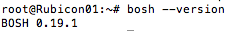
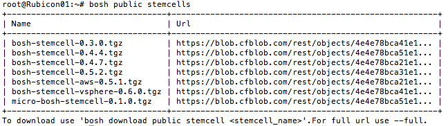
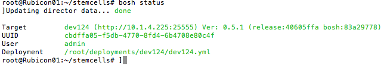

latex input:	mmd-article-header
Title:	End to End on vSphere
Author:	VMware 2012 - Cloud Foundry
Base Header Level:	2  
LaTeX Mode:	memoir  
latex input:	mmd-article-begin-doc
latex footer:	mmd-memoir-footer

# Introduction

The following document outlines how to deploy a distributed cloud application platform on vSphere using BOSH. It is intended as a practical supplement to the [official BOSH documentation](https://github.com/cloudfoundry/oss-docs/blob/master/bosh/documentation/documentation.md). 

The approach described here does not assume that you have a pre-existing BOSH director. As such, it is suited for someone who is building their vSphere BOSH instance from scratch.

We do assume some prior knowledge with ruby gems, building packages from source, Linux, and shell commands. However, beyond this basic familiarity, you do not need to be an expert on BOSH in order to deploy it. 

# Overview #

Here are the high-level steps that we will follow to deploy a cloud application platform using BOSH:

**Install BOSH CLI --> Deploy a Micro BOSH VM --> Deploy a BOSH instance --> Deploy a cloud application platform**

*Notes:*

*The BOSH CLI won't be part of the deployment itself. For this example, we will run the BOSH CLI from an Ubuntu 10.04 LTS VM.*

*Micro BOSH will be a separate VM that is deployed by the VM running the BOSH CLI. Using the BOSH CLI, we will target the Micro BOSH VM and use it to deploy a fully featured BOSH instance.*

*A full "BOSH" instance will be composed of multiple VMs (6 in this case.) Using the BOSH CLI (in our separate VM,) we will interact with the BOSH Director and use it to deploy a cloud application platform (40+ VMs.)*

# Install BOSH CLI

You need the BOSH Command Line Interface (CLI) to interact with both BOSH and Micro BOSH. The BOSH CLI installs as a gem. Although not required, you may want to use a Ruby version manager such as rbenv or RVM. [The official doc](https://github.com/cloudfoundry/oss-docs/blob/master/bosh/documentation/documentation.md) outlines the process for installing rbenv. 

The steps to install the BOSH CLI will be as follows:

1. Download and setup a stock Ubuntu 10.04 LTS Virtual Machine (VM)
1. Install a Ruby package manager (optional)
1. Install Ruby 1.9.2
1. Install the BOSH CLI gem
1. Install Micro BOSH components of the BOSH CLI

## Install a Ruby Package Manager (Optional)
Feel free to pick either package manager, but don't try to install them both, as they are not compatible. For the purposes of this exercise, we went with rbenv. 

You can get to the official rbenv page [here](https://github.com/sstephenson/rbenv)

The official RVM page is [here](http://rvm.beginrescueend.com/)

## Install Ruby 1.9.2

If you are using RVM, follow the [RVM guide](https://rvm.io/rubies/installing/) to installing rubies. 

If you are using rbenv, you have a couple of options. You can download ruby and build from source, which is the [approach presented](https://github.com/cloudfoundry/oss-docs/blob/master/bosh/documentation/documentation.md#installing-bosh-command-line-interface) in the official BOSH documentation. 

However, to make life easier, you can also install the [ruby-build gem](https://github.com/sstephenson/ruby-build), which allows you to install rubies through the rbenv command. Helpful. 

## Install BOSH CLI Gem ##

Install the BOSH CLI gem

+ `gem install bosh_cli`

+ `bosh --version`

## Install Micro BOSH CLI components ##

By default, the Micro BOSH components are not part of the BOSH CLI. You will need to build them from source and install them.

### Install Ubuntu Packages ###

If you are installing in Ubuntu, you may need to install some core packages as [described in the official documentation](https://github.com/cloudfoundry/oss-docs/blob/master/bosh/documentation/documentation.md#bosh-deployer) if they are not already installed.

`sudo apt-get -y install libsqlite3-dev genisoimage`

### Get the BOSH Source ###
To be able to create a Micro BOSH instance, you will need to build its components. If you haven't already cloned the BOSH source code from Gerrit, do so now. If you haven't already set up an account on the Gerrit server, go to the [workflow document](https://github.com/cloudfoundry/oss-docs/blob/master/workflow.md) and complete the steps required. 

When  you have a Gerrit account, you can run the following command to clone the BOSH source.

`gerrit clone ssh://[<your username>@]reviews.cloudfoundry.org:29418/bosh`

### Build the Micro BOSH Components

Now we move onto installing the Micro BOSH components into the BOSH CLI from the source code that you cloned. If your BOSH source code is in the directory `bosh`:

1. `cd bosh/deployer`

1. `bundle install`

1. `rake install`

# Deploy Micro BOSH #

Now that you have the BOSH CLI installed along with the micro BOSH components, you're ready to setup a Micro BOSH. This Micro BOSH will be a a single VM, deployed through the BOSH CLI, that will contain all the components necessary to deploy a distributed version of BOSH.

You'll need both a Micro BOSH [deployment manifest](./examples/micro_bosh.yml) and a Micro BOSH Stemcell.

## Get Micro BOSH Public Stemcell ##

On the machine running the BOSH CLI, download a public Micro BOSH Stemcell.

List the public BOSH stemcells: 

+ `bosh public stemcells`

Create a directory to organize your stemcells. This is just a matter of personal taste: 

+ `mkdir ~/stemcells`

Download the public stemcell:

+ `bosh download public stemcell micro-bosh-stemcell-0.1.0.tgz`

## Create Micro BOSH Deployment Manifest ##

It's important to note here that the deployment manifest requires the utmost attention during setup. Common errors including formatting problems in the YML file, incorrect IP addresses, and incorrect capitalization when specifying the names of resource pools and disk paths.

Once you do setup the manifest file, you're well on your way to deploying a BOSH of your own.

Here's a sample Micro BOSH [deployment manifest](./examples/micro_bosh.yml)

The official documentation [mentions](https://github.com/cloudfoundry/oss-docs/blob/master/bosh/documentation/documentation.md#prerequisites) that you need to place the deployment manifest in a `deployments` directory. There's actually a bit of a trick to this.

1. Create a `deployments` directory. This can be anywhere.

1. Within this `deployments` directory, make another directory. For example: `mkdir micro_deploy`

1. Place your Micro BOSH deployment manifest within the `micro_deploy` directory. You should now have:
`deployments/micro_deploy/micro_bosh.yml`

## Deploy ##

You're almost there with your Micro BOSH. You just need to set your deployment using the BOSH CLI (making it aware of your deployment manifest) and point it to a valid Micro BOSH stemcell.

In order for this to work, however, you need to run the commands from a specific directory.

1. `cd deployments # Go to the directory above your micro_deploy directory`

1. Set your deployment: `bosh micro deployment micro_deploy # Point the command to the directory which contains your micro_bosh.yml config file`

1. Check that your deployment is correctly set: `bosh micro deployment`

1. Point to a stemcell and deploy: `bosh micro deploy ~/stemcells/micro-bosh-stemcell-0.1.0.tgz`

Rock and roll! Wait for a few minutes for the deployment to complete. When it finishes you should run:

`bosh status`

This will show you the current state of your deployed Micro BOSH instance.

# Deploy BOSH

You should now have a fully functioning Micro BOSH instance. This Micro BOSH will be used to deploy a fully functioning, distributed BOSH. In the case of this example, your  deployed BOSH will consist of 6 VMs, for a total of 7 running VMs when you count your Micro BOSH.

When you deploy your BOSH, you should also expect to see additional VMs be created and destroyed. BOSH (and Micro BOSH) do a lot behind the scenes, and if you'd like to learn more you should check out the [architecture portion](https://github.com/cloudfoundry/oss-docs/blob/master/bosh/documentation/documentation.md#bosh-components) of the documentation.

## Get BOSH Public Stemcell##

Time to download a public BOSH stemcell. We'll keep this in the ~/stemcells directory we created earlier to keep things organized.
 
Same drill as before:

1. `bosh public stemcells`

1. `bosh download public stemcell bosh-stemcell-0.5.2.tgz`

## Target BOSH Director ##

Your Micro BOSH is also a BOSH Director. Make certain that it is set as your BOSH target. This is the part where 'inception' takes place.
We will be deploying a distributed version of BOSH using a Micro BOSH.

+ `bosh target`

The target listed should have the same IP address as your Micro BOSH. 

If it is not your current target, set that now:

+ `bosh target 10.1.2.10:25555`

The IP address and port were specified in your Micro BOSH deployment manifest. You can also find them using:  `bosh status`

## Upload Public Stemcell ##

Now that you've targeted your Director, time to upload the public stemcell you downloaded previously.

+ `bosh upload stemcell ~/stemcells/bosh-stemcell-0.5.2.tgz`

## Get BOSH Release ##

You'll need to download a BOSH release. Pull this from the public repository.

+ `gerrit clone ssh://[<your username>@]reviews.cloudfoundry.org:29418/bosh-release.git`

To upload the release to your Director, you'll need to be in a special 'release' directory once more in order to run the command successfully.

1. ` cd bosh-release`

1. `bosh upload release releases/bosh.yml`

You'll see a flurry of output as BOSH configures and uploads release components. 

## Create BOSH Deployment Manifest ##

Before you configure your manifest, you'll need the UUID of your Micro BOSH (which is your BOSH Director for now.) This will be used to fill in the `director_uuid:` parameter in the BOSH deployment manifest.

+ Run `bosh status` to get your UUID. Keep it in your clipboard.

Here's an [example BOSH deployment manifest](./examples/bosh_manifest.yml) with comments included where you need to configure parameters. Configure this for your environment, making certain to set the `director_uuid` parameter at the top of the file.

+ Use the BOSH CLI to set your current deployment. If you placed your deployment in ~/bosh-deployments, run the following command:  `bosh deployment ~/bosh-deployments/bosh.yml`

## Deploy

Let's quickly summarize what we've done in this section. We've targeted a working MicroBOSH and assigned it as our BOSH Director. We have uploaded both a public BOSH stemcell and a BOSH release to our BOSH Director. Finally, we have configured a BOSH deployment manifest to deploy BOSH itself (inception!) and set it as the current deployment using the BOSH CLI.

+ `bosh deploy`

In a few minutes, you should have a full, distributed BOSH running within your vCenter.

Let's check:

+ `bosh status`

# Deploy Cloud Application Platform

By now the deployment steps should seem somewhat familiar. We'll target our new BOSH Director (deployed when we used Micro BOSH to deploy BOSH,) upload a public BOSH stemcell, upload a cloud foundry appcloud release, configure and set a cloud application platform deployment manifest, and run: `bosh deploy`
 
## Target New BOSH Director ##

You'll need to target your new BOSH Director. Find out its IP address by running:

+ `bosh vms`

The first time you target the Director, you'll be asked to provide login credentials. These were specified in your BOSH [deployment manifest](./examples/bosh_manifest.yml).

+ `bosh target 10.1.4.225:25555 # Note the default port setting`

## Upload Stemcell ##

Your new Director needs a stemcell in order to deploy your cloud application platform. The steps should seem familiar now. Use your existing public stemcell in the `~/stemcells` directory. Do not use your Micro BOSH stemcell in this case.

+ `bosh upload stemcell ~/stemcells/bosh-stemcell-0.5.2.tgz`

## Get Cloud Release ##

For this exercise, we'll use a Release from the public repository:

+ `gerrit clone ssh://[<your username>@]reviews.cloudfoundry.org:29418/cf-release.git`

To upload the release to your Director, you'll need to be in a special 'release' directory once more in order to run the command successfully.

1. ` cd cf-release`

1. `bosh upload release releases/appcloud-82.yml`

You'll see a flurry of output as BOSH configures and uploads release components. 

## Create Cloud Deployment Manifest ##

For the purpose of this tutorial, we'll use a sample [deployment manifest](./examples/dev124.yml)

Keep in mind that a manifest of this size requires significant virtual hardware resources to run. According to the manifest file, you ideally need 72 vCPUs, 200GB of RAM, and 1 TB of storage. The more IOPS you can throw at the deployment, the better.

Use the BOSH CLI to set your current deployment. If you placed your deployment manifest yml in ~/deployments/dev124, run the following command: 

+ `bosh deployment ~/deployments/dev124/dev124.yml`

## Deploy ##

Let's summarize what we accomplished in this section -- we mirrored the steps we used to deploy BOSH. We targeted our new BOSH Director (running as part of a distributed BOSH,) uploaded a stemcell to the Director, uploaded a public cloud application platform release to the Director, configured a deployment manifest, and set the deployment manifest as the current deployment using the BOSH CLI. 

Now you get to watch your vCenter light up with tasks:

+ `bosh deploy`

If you'd like to learn more about what happens during the deployment process, read the official documentation's [explanation of a deployment](https://github.com/cloudfoundry/oss-docs/blob/master/bosh/documentation/documentation.md#bosh-deployments).

# Verification #

You watched your vCenter hard at work and followed the deployment logs, and now the job has finished. How do you verify that your platform is indeed functional?

At this point, you've crossed over from `bosh` territory to `vmc`. The `vmc` tool will allow you to push a sample app to your cloud application platform instance and test its functionality.

## Install VMC ##

VMC is the command line tool that will allow you to interact with your cloud application platform. You should be able to run VMC from any other machine that will allow you to install Ruby gems.  

1. Follow the [directions listed here](http://docs.cloudfoundry.com/tools/vmc/installing-vmc.html#installing-vmc-procedure) to install VMC.

## Build Sample App ##

1. Install the Sinatra web framework for Ruby: `gem install sinatra`

1. Write a [sample Sinatra application](http://docs.cloudfoundry.com/tools/vmc/installing-vmc.html#creating-a-simple-sinatra-application) 

## Deploy Sample App ##

*Note* There is one step you will need to add to the instructions listed below. You will need to add a user through vmc after running the `vmc target` command. 

To add a user, run `vmc add-user` and follow the on-screen prompts to create a user.

1. Follow [these instructions](http://docs.cloudfoundry.com/tools/vmc/installing-vmc.html#verifying-the-installation-by-deploying-a-sample-application) to push the sample Sinatra app to your cloud application platform

1. Visit the URL of your application, as provided during the `vmc push` operation, to verify that it works.

*Hint: In the case where you get JSON 404 errors when you try to use vmc to target your api, the best course of action is to use `bosh ssh` to connect to your router VM. The file `router.log` will likely show you if the router bound itself to a different IP address. This is indicative of possible configuration errors in your deployment manifest and/or problems with your external DNS configuration. More [here](https://github.com/cloudfoundry/vcap/issues/37).*

*What is the URL for the target? This is specified in the deployment manifest under the cc: component. It is given as the srv_api_uri: property.

*Where do you specify 'yourdomain.com' in the deployment? In the deployment manifest, there is a `domain: ` property. Put your domain here.

*Do you need DNS configured for your CF instance? Yes. The easiest way to set this up is with a wildcard DNS entry that points to your domain. The router component of CF will take care of routing requests to the correct apps.

# Summary #

In this tutorial, we installed the BOSH CLI, deployed a Micro BOSH instance, used Micro BOSH to deploy BOSH (inception,) and used BOSH to deploy a cloud application platform. 

For a deeper dive into BOSH, check out the [official docs](https://github.com/cloudfoundry/oss-docs/blob/master/bosh/documentation/documentation.md#bosh-deployments) on Github. 

There are also Google Groups for both [bosh-dev](https://groups.google.com/a/cloudfoundry.org/group/bosh-dev/topics?lnk) and [bosh-users](https://groups.google.com/a/cloudfoundry.org/group/bosh-users/topics)

