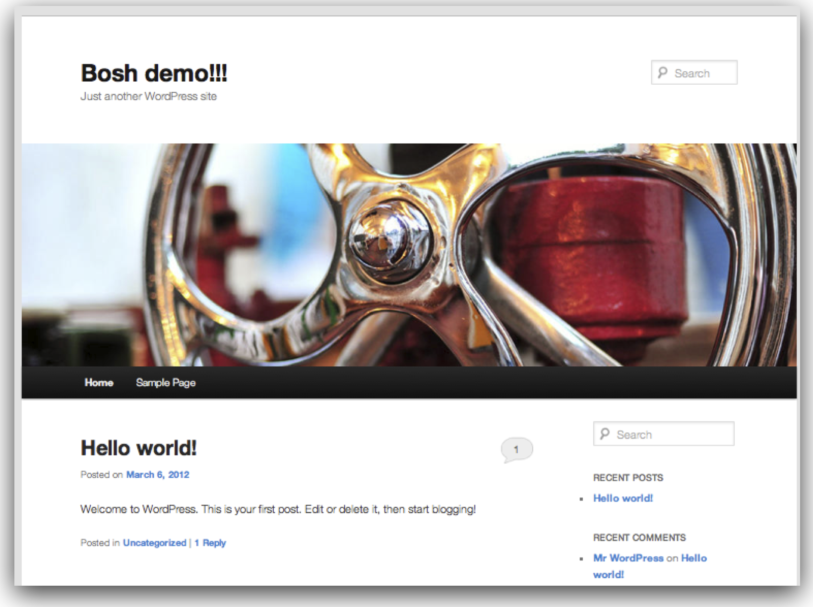

latex input:	mmd-article-header
Title:	BOSH Tutorial 
Author:	VMware 2012 - Cloud Foundry - Internal Use Only
Base Header Level:	2  
LaTeX Mode:	memoir  
latex input:	mmd-article-begin-doc
latex footer:	mmd-memoir-footer

Introduction
============

This tutorial will guide you through the process of deploying a multi-tier WordPress installation using BOSH. Due to its simplicity, WordPress is a good way to learn BOSH, but it is not a realistic use case. Most, if not all, of BOSH’s utility will be in the context of deploying Cloud Foundry.

Prerequisites
==========

# Installing BOSH on an Ubuntu VM

## Install Ruby via rbenv

1. Bosh is written in Ruby. Let's install Ruby's dependencies

		sudo apt-get install git-core build-essential libsqlite3-dev curl libmysqlclient-dev libxml2-dev libxslt-dev libpq-dev

1. Get the latest version of rbenv

		cd
		git clone git://github.com/sstephenson/rbenv.git .rbenv

1. Add `~/.rbenv/bin` to your `$PATH` for access to the `rbenv` command-line utility

		echo 'export PATH="$HOME/.rbenv/bin:$PATH"' >> ~/.bash_profile

1. Add rbenv init to your shell to enable shims and autocompletion

		echo 'eval "$(rbenv init -)"' >> ~/.bash_profile

1. Download Ruby 1.9.2

		wget http://ftp.ruby-lang.org/pub/ruby/1.9/ruby-1.9.2-p290.tar.gz

1. Unpack and install Ruby

		 tar xvfz ruby-1.9.2-p290.tar.gz
		 cd ruby-1.9.2-p290
		 ./configure --prefix=$HOME/.rbenv/versions/1.9.2-p290
		 make
		 make install

1. Restart your shell so the path changes take effect

		source ~/.bash_profile

1. Set your default Ruby to be version 1.9.2

		rbenv global 1.9.2-p290

## Install Local BOSH and BOSH Releases ##

1. Sign up for the Cloud Foundry Gerrit server at [http://cloudfoundry-codereview.qa.mozycloud.com/gerrit](http://cloudfoundry-codereview.qa.mozycloud.com/gerrit)

**NOTE: PUBLIC GERRIT IN FINAL DRAFT**

1. Set up your ssh public key (accept all defaults)

		ssh-keygen -t rsa
		
1. Copy your key from `~/.ssh/id_rsa.pub` into your Gerrit account
 
1.Create ~/.gitconfig as follows (Make sure that the email specified is registered with gerrit):
		
		[user]
		name = YOUR_NAME
		email = YOUR_EMAIL
		[alias]
		gerrit-clone = !bash -c 'gerrit-clone $@' -
		
1. Clone gerrit tools using git
		
		git clone git@github.com:vmware-ac/tools.git
		
**NOTE: PUBLIC TOOLS REPO IN FINAL DRAFT**

1. Add gerrit-clone to your path

		echo 'export PATH="$HOME/tools/gerrit/:$PATH"' >> ~/.bash_profile

 1. Restart your shell so the path changes take effect

		source ~/.bash_profile

1. Clone BOSH repositories from Gerrit

		git gerrit-clone ssh://cloudfoundry-codereview.qa.mozycloud.com:29418/bosh-sample-release
		git gerrit-clone ssh://cloudfoundry-codereview.qa.mozycloud.com:29418/release.git
		git gerrit-clone ssh://cloudfoundry-codereview.qa.mozycloud.com:29418/bos.git
		
1. Run some rake tasks to install the BOSH CLI

		cd ~/bosh
		rake bundle_install
		cd cli
		bundle exec rake build
		gem install pkg/bosh_cli-x.x.x.gem

## Deploy to your BOSH Environment

With a fully configured environment, we can begin deploying the sample application to our environment. As listed in the prerequisites, you should already have an environment running, as well as the IP address of the BOSH Director. Ask your BOSH technical contact for help if you need it.

### Point BOSH at a Target and Clean your Environment ###

1. Target your director (this IP is an example) **NOTE: EXAMPLE WORKS FOR INTERNAL USE (u: admin / p: admin)**

		bosh target 172.23.128.219:25555 

1. Check the state of your BOSH settings.

		bosh status
		
1. The result of your status will be akin to:

		Target         dev48 (http://172.23.128.219:25555) Ver: 0.3.12 (01169817)
		UUID           4a8a029c-f0ae-49a2-b016-c8f47aa1ac85
		User           admin
		Deployment     not set

1. List previous deployments (we will remove them in a moment)
    
		bosh deployments

1. The result of `bosh deployments` should be akin to:

		+-------+
		| Name  |
		+-------+
		| dev48 |
		+-------+

1. Delete the existing deployments (ex: dev48) 

		bosh delete deployment dev48

1. Answer `yes` to the prompt and wait for the deletion to complete

1. List previous releases (we will remove them in a moment)

		`bosh releases`

1. The result of `bosh releases` should be akin to:

		+----------+------------+
		| Name	   | Versions 	|
		+----------+------------+
		| appcloud | 47, 55, 58 |
		+----------+------------+
		
1. Delete the existing releases (ex: appcloud) 

		bosh delete release appcloud

1. Answer `yes` to the prompt and wait for the deletion to complete

### Create a Release ###

1. Change directories into bosh-sample-release:

		cd ~/bosh-sample-release
	
	This directory contains the sample WordPress deployment and release files. If this were a Cloud Foundry deploy, you would work with analogous files, provided by your BOSH contact.

1. Reset your environment

		bosh reset release

1. Answer `yes` to the prompt and wait for the environment to be reset

1. Create a release

		bosh create release –force –with-tarball
		
1. Answer `wordpress` to the `release name` prompt

1. Your terminal will display information about the release including the Release Manifest, Packages, Jobs, and tarball location.

1. Open `bosh-sample-release/wordpress.yml` in your favorite text editor and confirm that `name` is `wordpress` and `version` matches the version that was displayed in your terminal (if this is your first release, this will be version 1).

### Deploy the Release ###

1. Upload the WordPress example Release to your Environment

		bosh upload release dev_releases/wordpress-1.tgz
		
1. Your terminal will display information about the upload, and an upload progress bar will reach 100% after a few minutes.

1. Open `bosh-sample-release/wordpress.yml` and make sure that your networking and IP addresses match the environment that you were given. An example manifest is in the Appendix.

1. Deploy the Release

		bosh deploy
		
1. Your deployment will take a few minutes.

1. Copy the URL for your WordPress installation from the `properties.wordpress.servername` value in `wordpress.yml`

1. Browse your WordPress blog at this URL.

1. Complete the form to install your WordPress blog

## Appendix ##

		---
		name: wordpress
		director_uuid: 4a8a029c-f0ae-49a2-b016-c8f47aa1ac85

		release:
			name: wordpress
			version: 1

		compilation:
			workers: 4
			network: default
			cloud_properties:
				ram: 2048
				disk: 8096
				cpu: 2

		# this section describes how updates are handled

		update:
			canaries: 1
			canary_watch_time: 30000
			update_watch_time: 30000
			max_in_flight: 4
			max_errors: 1

		networks:
		- name: default
			subnets:
			- reserved:
    			- 172.23.224.2 - 172.23.224.10
    			- 172.23.224.200 - 172.23.224.254
    		static:
    			- 172.23.224.11 - 172.23.224.100
    			range: 172.23.224.0/23
    			gateway: 172.23.224.1
    		dns:
    			- 172.22.22.153
    			- 172.22.22.154
    		cloud_properties:
      			name: VLAN2224

		- name: dmz
		  subnets:
		  - static:
		  	- 172.20.4.241 - 172.20.4.242
		  range: 172.20.4.241/28
		  dns:
		  	- 172.22.22.153
		  	- 172.22.22.154
		  cloud_properties:
		  	name: VLAN3079

		resource_pools:

			- name: infrastructure
			network: default
			size: 6
			stemcell:
				name: bosh-stemcell
				version: 0.4.4
			cloud_properties:
				cpu: 1
				disk: 8192
				ram: 4096

		jobs:
			- name: mysql
			template: mysql
			instances: 1
			resource_pool: infrastructure
			persistent_disk: 16384
			networks:
				- name: default
				static_ips:
					- 172.23.224.11

			- name: wordpress
			template: wordpress
			instances: 4
			resource_pool: infrastructure
			networks:
				- name: default
				static_ips:
					- 172.23.224.12 - 172.23.224.15

			- name: nginx
			template: nginx
			instances: 1
			resource_pool: infrastructure
			networks:
				- name: default
					default: [dns, gateway]
					static_ips:
						- 172.23.224.1
				- name: dmz
					static_ips:
						- 172.20.4.241

		properties:
			wordpress:
				admin: foo@bar.com
				port: 8008
				servers:
						- 172.23.224.12
						- 172.23.224.13
						- 172.23.224.14
						- 172.23.224.15
				servername: wp.cf48.dev.las01.vcsops.com
				db:
					name: wp
					user: wordpress
					pass: w0rdpr3ss
				auth_key: random key
				secure_auth_key: random key
				logged_in_key: random key
				nonce_key: random key
				auth_salt: random key
				secure_auth_salt: random key
				logged_in_salt: random key
				nonce_salt: random key
			mysql:
				address: 172.23.224.11
				port: 3306
				password: verysecretpasswordforroot
			nginx:
				workers: 1

